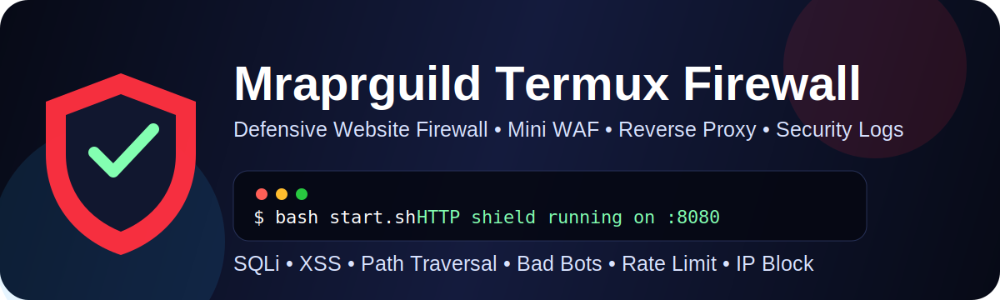
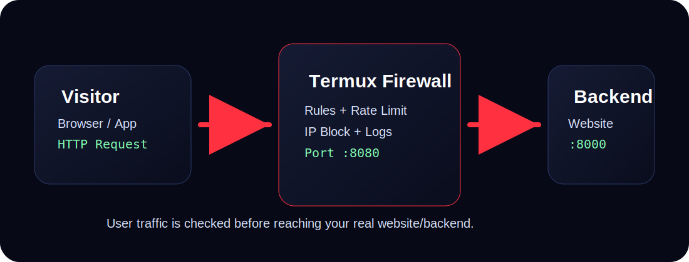

<p align="center">
  
</p>

<h1 align="center">🛡️ Mraprguild Termux Website Firewall</h1>

<p align="center">
  Defensive Website Firewall / Mini WAF reverse proxy for Termux.
</p>

<p align="center">
  <a href="#"></a>
  <a href="#"></a>
  <a href="#"></a>
  <a href="#"></a>
</p>

<p align="center">
  <b>SQLi Block</b> • <b>XSS Block</b> • <b>Path Traversal Block</b> • <b>Bad Bot Block</b> • <b>Rate Limit</b> • <b>IP Block</b> • <b>Security Logs</b>
</p>

---

## ⚠️ Safe use

This project is for **defensive security only**.

Use it only for:

- Your own website
- Your own Termux server
- Your own WordPress site
- Your own local test app
- Systems where you have permission to protect

Do not use this to attack, bypass, scan, or damage other websites.

---

## 🚀 What is this?

**Mraprguild Termux Website Firewall** is a small Python reverse proxy firewall.

It sits between users and your website:

<p align="center">
  
</p>

```text
Visitor → Termux Firewall :8080 → Real Website Backend :8000
```

Before forwarding traffic to your backend, it checks requests for suspicious patterns and blocks common attack traffic.

---

## ✨ Features

| Feature | Details |
|---|---|
| SQL injection blocking | Detects common SQLi payload patterns |
| XSS blocking | Blocks script tags, JavaScript URLs, and common event payloads |
| Path traversal blocking | Blocks `../`, `/etc/passwd`, `php://`, and file traversal attempts |
| Command injection pattern blocking | Blocks common shell injection patterns |
| Bad bot blocking | Blocks scanner User-Agent keywords |
| Rate limiting | Limits too many requests from the same IP |
| Sensitive path blocking | Blocks `.env`, `wp-config.php`, `database.sql`, and more |
| IP block list | Manually block IPs or CIDR ranges |
| IP allow list | Allow trusted IPs |
| JSON logs | Blocked requests saved to `logs/blocked.log` |
| Termux ready | Works with `pkg`, Python, Flask, and Requests |
| GitHub ready | README, docs, assets, issue templates, and workflow included |

---

## 📦 Project structure

```text
termux-website-firewall/
├── assets/
│   ├── banner.svg
│   ├── architecture.svg
│   └── terminal-demo.svg
├── docs/
│   └── WORDPRESS.md
├── rules/
│   ├── allowed_ips.txt
│   ├── blocked_ips.txt
│   └── bad_bots.txt
├── logs/
│   └── blocked.log
├── waf.py
├── install.sh
├── start.sh
├── demo_backend.sh
├── security_test.sh
├── config.yml
├── config.example.yml
├── config.strict.yml
├── requirements.txt
├── SECURITY.md
├── HARDENING.md
├── CHANGELOG.md
├── CONTRIBUTING.md
└── LICENSE.txt
```

---

## ⚡ Single command install

After uploading this project to GitHub as:

```text
https://github.com/Mraprguild/termux-website-firewall
```

Use this Termux command:

```bash
pkg update -y && pkg upgrade -y && pkg install -y git python unzip nano && git clone https://github.com/Mraprguild/termux-website-firewall.git && cd termux-website-firewall && bash install.sh
```

---

## 🔧 Manual install

```bash
pkg update -y
pkg upgrade -y
pkg install -y python git nano unzip
python -m pip install --upgrade pip
git clone https://github.com/Mraprguild/termux-website-firewall.git
cd termux-website-firewall
bash install.sh
```

---

## ▶️ Start firewall

```bash
bash start.sh
```

Default firewall address:

```text
http://127.0.0.1:8080
```

Status endpoint:

```text
http://127.0.0.1:8080/__waf_status
```

---

## 🎬 Animated terminal demo

<p align="center">
  
</p>

---

## 🧪 Quick demo test

Open **Termux session 1**:

```bash
bash demo_backend.sh
```

Open **Termux session 2**:

```bash
bash start.sh
```

Open **Termux session 3**:

```bash
bash security_test.sh
```

Expected result:

```text
✅ Clean homepage -> HTTP 200
✅ SQL injection blocked -> HTTP 403
✅ XSS blocked -> HTTP 403
✅ Sensitive file blocked -> HTTP 403
✅ Path traversal blocked -> HTTP 403
```

---

## 🌐 Configure your backend

Edit:

```bash
nano config.yml
```

Default:

```yml
upstream: "http://127.0.0.1:8000"
listen_host: "0.0.0.0"
listen_port: 8080
```

Example:

If your real website runs on port `8000`, visitors should access the firewall on port `8080`.

```text
User → http://PHONE_IP:8080 → Backend http://127.0.0.1:8000
```

---

## 🔥 Strict security mode

Use strict config:

```bash
cp config.strict.yml config.yml
nano config.yml
bash start.sh
```

Strict mode uses:

```yml
max_body_bytes: 1048576
rate_limit_requests: 30
rate_limit_seconds: 60
```

This is best for small websites without large file uploads.

---

## 🛡️ Security modules

Enable or disable modules in `config.yml`:

```yml
modules:
  sql_injection: true
  xss: true
  path_traversal: true
  command_injection: true
  bad_bots: true
  rate_limit: true
  block_sensitive_paths: true
```

Recommended: keep all enabled.

---

## 🚫 Block sensitive files

Default blocked paths:

```yml
blocked_paths:
  - "/.env"
  - "/wp-config.php"
  - "/config.php"
  - "/backup.zip"
  - "/database.sql"
  - "/phpmyadmin"
  - "/xmlrpc.php"
```

WordPress extra protection:

```yml
  - "/readme.html"
  - "/license.txt"
  - "/wp-admin/install.php"
  - "/wp-admin/setup-config.php"
```

---

## 🤖 Bad bot blocking

Edit:

```bash
nano rules/bad_bots.txt
```

Default scanner keywords:

```text
sqlmap
nikto
acunetix
nessus
masscan
nmap
dirbuster
gobuster
ffuf
wpscan
zgrab
```

`curl` and `wget` are not blocked by default because they are useful for local tests.

---

## 🌍 IP allow/block

Block one IP:

```bash
echo "1.2.3.4" >> rules/blocked_ips.txt
```

Block subnet:

```bash
echo "1.2.3.0/24" >> rules/blocked_ips.txt
```

Allow trusted IP:

```bash
echo "1.2.3.4" >> rules/allowed_ips.txt
```

Allowed IPs bypass rule checks, so only add trusted IPs.

---

## 📜 Security logs

Blocked requests are saved here:

```bash
logs/blocked.log
```

Watch live:

```bash
tail -f logs/blocked.log
```

Example log:

```json
{"time":"2026-06-29T10:00:00+05:30","ip":"127.0.0.1","method":"GET","path":"/?id=1 union select","status":403,"reason":"sql_injection rule matched","user_agent":"curl/8"}
```

---

## 🧪 Manual test commands

Clean request:

```bash
curl -i http://127.0.0.1:8080/
```

SQL injection block test:

```bash
curl -i "http://127.0.0.1:8080/?id=1%20union%20select%20password%20from%20users"
```

XSS block test:

```bash
curl -i "http://127.0.0.1:8080/?q=%3Cscript%3Ealert(1)%3C/script%3E"
```

Sensitive file block test:

```bash
curl -i http://127.0.0.1:8080/.env
```

Path traversal block test:

```bash
curl -i "http://127.0.0.1:8080/download?file=../../etc/passwd"
```

---

## 📱 LAN testing from another device

Find phone IP:

```bash
ip addr
```

Open from another device on the same Wi-Fi:

```text
http://PHONE_IP:8080
```

---

## 🔐 HTTPS note

This Python firewall does not create HTTPS certificates by itself.

For public production, use one of these in front:

- Cloudflare
- Nginx with SSL
- Caddy with automatic HTTPS
- Hosting reverse proxy
- VPS firewall

Local testing over HTTP is okay. Public login pages should use HTTPS.

---

## 🧩 WordPress setup

For WordPress, recommended blocked paths:

```yml
blocked_paths:
  - "/.env"
  - "/wp-config.php"
  - "/xmlrpc.php"
  - "/readme.html"
  - "/license.txt"
  - "/backup.zip"
  - "/database.sql"
  - "/phpmyadmin"
```

More details:

```bash
cat docs/WORDPRESS.md
```

---

## 📤 Upload/download website setup

For upload sites, increase body size carefully.

Example 200 MB:

```yml
max_body_bytes: 209715200
rate_limit_requests: 120
rate_limit_seconds: 60
```

Backend security still required:

- Validate file extension
- Rename uploaded files
- Store uploads safely
- Do not execute uploaded files
- Use login for private uploads
- Use temporary/signed download links

---

## 🧯 Troubleshooting

### Backend connection failed

Check backend is running:

```bash
curl http://127.0.0.1:8000
```

Check `config.yml`:

```yml
upstream: "http://127.0.0.1:8000"
```

### Normal users blocked

Check logs:

```bash
tail -f logs/blocked.log
```

Then tune rule or disable only the problem module temporarily.

### Port already used

Change port:

```yml
listen_port: 8090
```

Restart:

```bash
bash start.sh
```

### Public website not protected

Traffic must pass through firewall. If users can still access your backend directly, they can bypass protection.

---

## 🧠 Production security checklist

- [ ] Backend is private
- [ ] HTTPS enabled
- [ ] Strong admin password
- [ ] App/plugins/themes updated
- [ ] Backups enabled
- [ ] Firewall rules tested
- [ ] Logs monitored
- [ ] False positives reviewed
- [ ] Sensitive paths blocked
- [ ] Upload rules configured
- [ ] Rate limit tuned
- [ ] Admin panel protected

---

## 🔄 Update

```bash
git pull
pkg update -y
pkg upgrade -y
python -m pip install --upgrade -r requirements.txt
bash start.sh
```

---

## 🤝 Contributing

Pull requests are welcome for defensive security improvements, documentation, and bug fixes.

Read:

```bash
cat CONTRIBUTING.md
```

---

## 📄 License

MIT License.

Author: **Mraprguild**

---

<p align="center">
  <b>Made for defensive website protection on Termux.</b>
</p>
